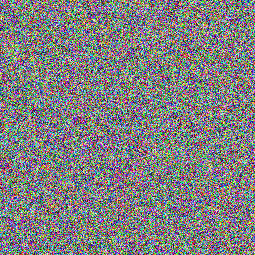

# js-steganography

A simple image steganography tool in javascript.  This tool will encode up to 255 characters in an image file.  

Run in browser via CodePen: https://codepen.io/anon/pen/WayLMQ

# Method

The encode_message js function is contained in the html page.  

Each pixel contains an 8-bit Red, Green, Blue, and Alpha channel.  

The 0th pixel contains:  
* Message length in the Red channel
* The Green channel is unmodified, and used as an offset index to encode the first message byte
* If the offset is 0, then the next pixel is used
* Message checksum in the Blue channel

At each n-th pixel that follows:  
* The message's high nibble overwrite the low nibble of the pixel's Red channel
* The message's low nibble overwrite the low nibble of the pixel's Blue channel
* The Green channel is again, skipped as an offset to the next location used to encode data.
* If the offset is 0, then the next pixel is used

Data is written until:  
* The entire message is encoded -or-
* 255 bytes have been encoded -or-
* The target image runs out of space

Encoded message length and checksum are written to the 0th pixel last.  

Structure:  
```
[a pixel| (Red color channel; Green color channel; Blue color channel; Alpha color channel) ]
[pixel 0| (Message length   ; Offset to next byte, Checksum          ; Unmodified         ) ]
[pixel N| (R| msg hi nibble ; Offset to next byte; B| msg lo nibble  ; Unmodified         ) ]
[...etc...]
```

# Examples

Image on the left is normal.  Image on the right contains encoded message.  

 

 

 
